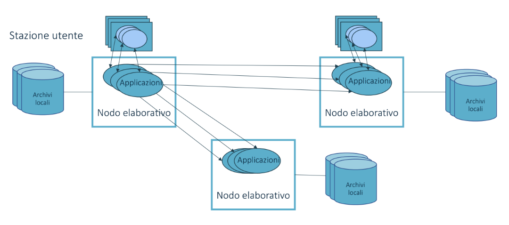

# Sistemi Centralizzati

Dati e applicazioni risiedono in un **unico nodo elaborativo**

# Sistemi Distribuiti

Si definiscono tali se almeno una di queste due condizioni è verificata:
- **Elaborazione Distributiva**: più host collaborano all'elaborazione
- **Database Distributivo**: i dati sono memorizzati da più host

> E' costituito da un insieme di **applicazioni logicamente indipendenti** che collaborano per raggiungere **obiettivi comuni** tramite un'**infrastruttura di comunicazione** hardware e software

## Rouli delle applicazioni

- **Client**: **utilizza servizi** messi a disposizione da altre applicazioni
- **Server**: **fornisce servizi** utilizzati da altre applicazioni
- **Actor**: assume in diverse situazioni il ruolo di Client o di Server

## Esempi

- Internet
- Web
- Intranet
- Home network
- Personal Area Network e wearable computing
- Reti di sensori
- Internet of Things

## Vantaggi

### Affidabilità

Un sistema distribuito **resiste anche in caso di guasto** di un componente  
E' necessario **prevenire** queste situazioni predisponendo **elementi ridondanti** in grado di intervenire automaticamente

### Integrazione

E' la capacità di **integrare componenti spesso eterogenei** tra loro, sia per hardware che per sistema operativo  
Ogni componente deve potersi **interfacciare allo stesso modo**, l'interfaccia (software, non grafica) elimina le eterogeneità dei componenti del livello inferiore della rete di comunicazione  
E' fondamentale la **possibilità di connettere dispositivi di nuova generazione** ai sistemi legacy

### Trasparenza

Concetto di usufruire del servizio fornito dal sistema **come se fosse un unico sistema di elaborazione** (e quindi utilizzare il sistema distribuito come unico)

Reference Model of Open Distributed Processing identifica 8 forme di trasparenza:
- **Access Transparency**: l'accesso alle risorse è effettuato in modo unico e uniforme indipendentemente dalla loro posizione locale o remota
- **Location Transparency**: la posizione fisica e logica di una risorsa è nascosta ed è possibile accedervi in modo univoco e uniforme
- **Concurrency Transparency**: i processi possono operare concorrentemente, facendo in modo che le risorse siano sempre lasciate in uno stato consistente
- **Replication Transparency**: le operazioni di replicazione e le repliche sono trasparenti all'utente
- **Failure Transparency**: i guasti e i ripristini delle risorse sono mascherati
- **Mobility Transparency**: gli spostamenti delle risorse sono nascosti e non influenzano le operazioni degli utenti
- **Performance Transparency**: le operazioni di riconfigurazione che sono eseguite al variare del carico sono trasparenti
- **Scaling Transparency**: il sistema viene esteso senza interromperne o modificarne il funzionamento

### Economicità

Miglior rapporto qualità/prezzo  
Il prezzo di un'operazione di scaling è ridotto perchè consente l'acquisto di solo gli elementi necessari  
E' possibile connettere anche sistemi legacy

### Apertura

Definizione di protocolli standard, favorisce:
- **Interoperabilità**: implementazioni diverse su elaboratori di diverso tipo possono coesistere in un'unico sistema
- **Portabilità**: un'applicazione sviluppata su un sistema operativo può funzionare su un altro con la medesima interfaccia
- **Apliabilità**: è relativamente semplice aggiungere componenti hardware e software

### Connettività e collaborazione

Possibilità di condividere risorse hardware e software, ovvero far utilizzare un sistema o un dispositivo a più nodi

### Prestazioni e scalabilità

**Scalabilità orizzontale**: la crescita di un sistema distrubuito fornisce a tutti i suoi componenti un miglioramento delle prestazioni e permette di sostenere l'aumento del carico delle richieste  
Concettualmente non esiste una limitazione del numero di risorse disponibili

### Tolleranza ai guasti

La possibilità di replicare risorse offre una modesta tolleranza ai guasti, trasformando quello che sarebbe stato un guasto dell'intero sistema in un guasto parziale con al massimo l'introduzione dell'aumento del tempo di risposta

## Svantaggi

### Prodizione di software

Con il tempo sono stati introdotti diversi standard e linguaggi di programmazione, è complicato matenere ed aggiornare i sistemi più vecchi

### Complessità

Per la struttura hardware e software interconnessa i sistemi distribuiti sono più complessi, è più difficile valuare le performance e sono richiesti strumenti per l'interconnessione degli host e tecniche di instradamento dei messaggi

### Sicurezza

Con l'aumentare dei nodi aumenta la possibilità di avere falle di sicurezza nel software, che consentono l'accesso non autorizzato alle risorse, non è più sufficiente limitare il solo accesso fisico al sistema

### Comunicazione

La mancanza di prevedibilità delle richieste genera situazioni di carico molto differenti anche a breve distanza di tempo, inoltre le tecniche di analisi e progettazione sono spesso basate sui vecchi metodi di sviluppo monoprocesso

## Classificazione

### Sistemi di calcolo distribuiti

Generalmente configurati per il calcolo ad alte prestazioni

- **Cluster Computing**: componenti omogenee
- **Grid Coputing**: componenti eterogenee

### Sistemi informativi distribuiti

Forniscono servizi di comunicazione e di interscambio dati  
Nei sistemi transazionali ogni transazione consiste in un insieme di operazioni elementari incapsulate in due comandi inizio-fine transazione

### Sistemi distribuiti pervasivi

Nuova generazione di sistemi con connessioni tipicamente wireless e che generalmente sono sottoparti di sistemi più grandi

## Architettura di Flynn

Suddivide le **informazioni** in:
- flusso di **istruzioni**
- flusso di **dati**

|                          | Single Data | Multiple Data |
|--------------------------|-------------|---------------|
| **Single Instruction**   | SISD        | SIMD          |
| **Multiple Instruction** | MISD        | MIMD          |

### SISD

Macchina di Von Neumann  
Tutte le macchine con una sola CPU appartengono a questa categoria

### SIMD

Elaborazione su più flussi di dati con un singolo flusso di istruzioni  
Generalmente sono presenti più processori:
- Vector Processor
- Array Processor

### MISD

Elaboratori che eseguono più operazioni sullo stesso flusso di dati

### MIMD

Comprende tutte le tipologie di elaboratori composti da più CPU indipendenti che possono operare su stream di dati anch'essi indipendenti

- **Memoria fisica condivisa** -> **Multiprocessor**:  
    
  La memoria è comune, esiste un'unico spazio di indirizzamento condiviso tra tutti i processori
- **Memoria privata** -> **Multicomputer**:  
    
  Non è presente una memoria condivisa, la comunicazione avviene attraverso lo scambio di messaggi esplicito  
  Reti di connessione:
  - Ipercubi
  - Mesh
  - Torus